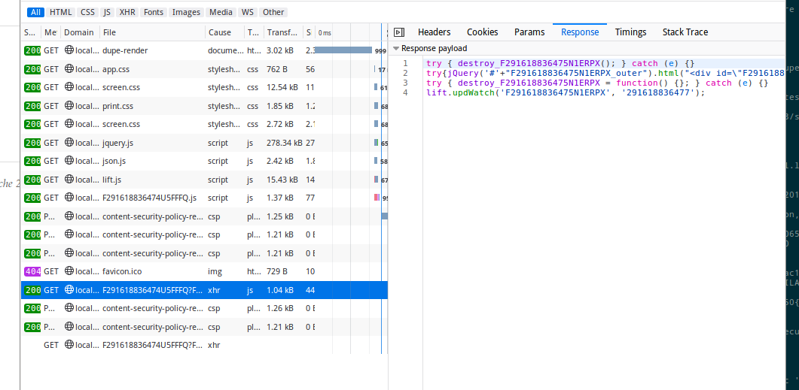

Instructions...

1. Run sbt
1. ~jetty:start
1. Open your browser, open developer tools then the network tab
1. Visit http://localhost:8080/dupe-render
1. Observe the traffic in the network tab

I see something similar to the below:

A completed comet callback can be seen (selected). The contents of this include a call to replace the html of the comet component.

Expected behaviour: the initial render is complete.